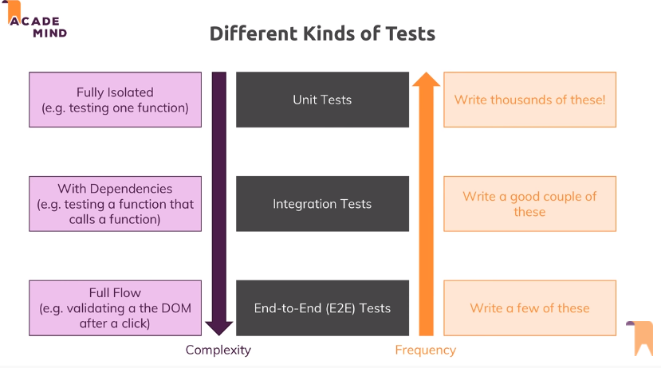
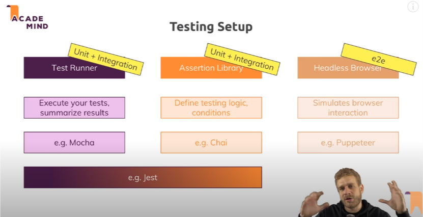

# Unit Tests, Integration Tests & End-to-End Tests

## Types of Tests

*   Unit tests that test one isolated unit/ piece of code (e.g. a function)

*   Integration tests which test the combination of features (e.g. a function calling another function)

*   End-to-End (e2e) or UI tests which test a full interaction path in your app (e.g. the signup process)

## Tools of Testing

## Three types of files:

1. `filename.test.js`
2. `filename.spec.js`
3. `__test__/fileName.js`

## References

https://academind.com/learn/javascript/javascript-testing-introduction/

https://academind.com/learn/react/testing-react-apps/

https://testingjavascript.com/

https://kentcdodds.com/blog/unit-vs-integration-vs-e2e-tests

https://github.com/larrybotha/testing-javascript

https://egghead.io/playlists/testing-javascript-with-jest-a36c4074
